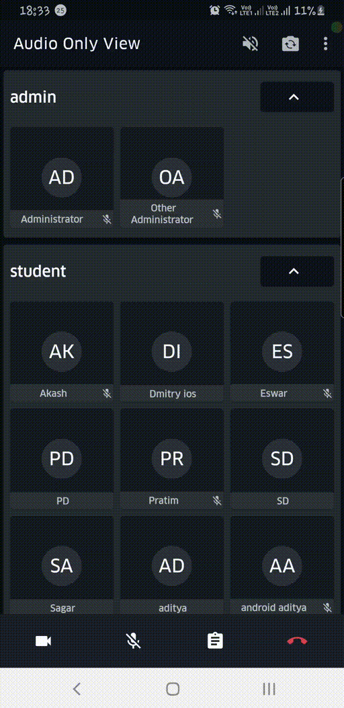

<a href="https://100ms.live/">
 

</a>

[](https://docs.100ms.live/android/v2/release-notes/Release-Notes)
[](https://docs.100ms.live/android/v2/foundation/Basics)
[](https://100ms.live/discord)
[](https://appdistribution.firebase.dev/i/d8f1648365a33c3e)
[](https://github.com/100mslive/100ms-android/pulls)
[](https://dashboard.100ms.live/register)


# 🎉 100ms SDK ＆ Sample App 🚀

Here you will find everything you need to build experiences with video using 100ms Android SDK. Dive into our SDKs, quick starts, add real-time video, voice, and screen sharing to your web and mobile applications.

## ☝️ Pre-requisites

- Android Studio 3.0 or higher
- Support for Android API level 24 or higher
- Support for Java 8
- This application uses build tool version `30.0.2`

## 📱 Supported Devices

The Android SDK supports Android API level 21 and higher. It is built for armeabi-v7a, arm64-v8a, x86, and x86_64 architectures.

## 🚂 Setup Guide

- Clone this repository

```bash
git clone --depth 1 https://github.com/100mslive/sample-app-android.git
```

- Get your token generation endpoint [by following this guide](https://docs.100ms.live/server-side/v2/foundation/authentication-and-tokens)

- Create `app/gradle.properties`

  ```bash
  cp app/example.gradle.properties app/gradle.properties
  ```

- Put your endpoint URL as `TOKEN_ENDPOINT` in `app/gradle.properties`. Make sure it ends with a backslash (`/`) For example:
  ```env
  TOKEN_ENDPOINT="https://prod-in.100ms.live/hmsapi/<your-subdomain>/" # Valid
  TOKEN_ENDPOINT="https://prod-in.100ms.live/hmsapi/<your-subdomain>" # Invalid
  ```
- Create [firebase project](https://firebase.google.com/docs/android/setup#console) and save the [`google-services.json`](https://support.google.com/firebase/answer/7015592?hl=en) in `app/google-services.json`

## 🏎 Run the application

### 🤖 Run using Emulator

Follow the official guide at [developers.android.com](https://developer.android.com/studio/run/emulator) to download and deploying app in a emulator.

### 📱 Run on Device (**recommended**)

Follow the official guide at [developers.android.com](https://developer.android.com/studio/run/device) to setup your mobile device for development.

On the first time of launch, user will be prompted with permissions. Then you are good to go to run the application.

## 🏞 Layout

In the launch screen, here we have `Enter Name` and `Join Room`:

We have many examples for each mode in the sample app using [`RecyclerView`](https://developer.android.com/reference/androidx/recyclerview/widget/RecyclerView), [`ViewPage2`](https://developer.android.com/jetpack/androidx/releases/viewpager2), [`LiveData](https://developer.android.com/topic/libraries/architecture/livedata) handling all data the right way with smooth updates.

### 📞 Join meeting

- Paste the exact Room ID as obtained after signing up for the [100ms Dashboard] (https://dashboard.100ms.live/register)

- Click `Join Now`.
- Video Conversation will be started 🎉


### Active Speaker Mode

Shows the most actively speaking `Peer`'s in the room. Max number of peer's to be displayed can be configured be `Max Rows` and `Max Columns` setting in the Home Page.

Each `Peer`'s VideoTile shows following updates in real-time:

1. Blue border if speaking at that moment
2. Audio/Video track's mute/unmute status
3. Live Updates of `Peer`'s joining and leaving

Related classes/files in this app:
  1. [`ActiveSpeakerFragment`](app/src/main/java/live/hms/app2/ui/meeting/activespeaker/ActiveSpeakerFragment.kt)
  2. [`ActiveSpeakerLRU`](app/src/main/java/live/hms/app2/ui/meeting/activespeaker/ActiveSpeakerLRU.kt)
  3. [`fragment_active_speaker.xml`](app/src/main/res/layout/fragment_active_speaker.xml)
  4. [`video_card.xml`](app/src/main/res/layout/video_card.xml)

<p>
  
  
</p>

### 🎵 Audio Only Mode

Groups all `Peer`'s by their `Peer::role` and shows them using a nested `RecyclerView`:

Each `Peer`'s AudioTile shows following updates in real-time:

1. Blue border if speaking at that moment
2. Audio/Video track's mute/unmute status
3. Live Updates of `Peer`'s joining and leaving

Related classes/files in this app:
  1. [`AudioCollection`](app/src/main/java/live/hms/app2/ui/meeting/audiomode/AudioCollection.kt)
  2. [`AudioCollectionAdapter`](app/src/main/java/live/hms/app2/ui/meeting/audiomode/AudioCollectionAdapter.kt)
  3. [`AudioCollectionDiffUtil`](app/src/main/java/live/hms/app2/ui/meeting/audiomode/AudioCollectionDiffUtil.kt)
  4. [`AudioItem`](app/src/main/java/live/hms/app2/ui/meeting/audiomode/AudioItem.kt)
  5. [`AudioItemsAdapter`](app/src/main/java/live/hms/app2/ui/meeting/audiomode/AudioItemsAdapter.kt)
  6. [`AudioItemsDiffUtil`](app/src/main/java/live/hms/app2/ui/meeting/audiomode/AudioItemsDiffUtil.kt)
  7. [`AudioModeFragment`](app/src/main/java/live/hms/app2/ui/meeting/audiomode/AudioModeFragment.kt)
  8. [`fragment_audio.xml`](app/src/main/res/layout/fragment_audio.xml)
  9. [`list_item_audio.xml`](app/src/main/res/layout/list_item_audio.xml)
  10. [`list_item_chat.xml`](app/src/main/res/layout/list_item_chat.xml)

<p>
  
  
</p>

### 📚 Grid View

Show's all `Peer`'s in a 2x2 (default) Grid paginated using a `ViewPager`.

Each `Peer`'s VideoTile shows following updates in real-time:

1. Blue border if speaking at that moment
2. Audio/Video track's mute/unmute status
3. Live Updates of `Peer`'s joining and leaving
4. Subscribes/Unsubscribe videos which are not visible in the viewport
5. Handles updating the peer tracks status and peer-list smoothly without causing any re-renders

Related classes/files in this app:
  1. [`VideoGridBaseFragment`](app/src/main/java/live/hms/app2/ui/meeting/commons/VideoGridBaseFragment.kt)
  2. [`VideoGridAdapter`](app/src/main/java/live/hms/app2/ui/meeting/videogrid/VideoGridAdapter.kt)
  3. [`VideoGridFragment`](app/src/main/java/live/hms/app2/ui/meeting/videogrid/VideoGridFragment.kt)
  4. [`VideoGridPageFragment`](app/src/main/java/live/hms/app2/ui/meeting/videogrid/VideoGridPageFragment.kt)
  5. [`VideoGridPageItem`](app/src/main/java/live/hms/app2/ui/meeting/videogrid/VideoGridPageItem.kt)
  6. [`VideoGridPageDiffUtil`](app/src/main/java/live/hms/app2/ui/meeting/videogrid/VideoGridPagerDiffUtil.kt)
  7. [`VideoGridPageViewModel`](app/src/main/java/live/hms/app2/ui/meeting/videogrid/VideoGridPageViewModel.kt)
  8. [`fragment_video_grid_page.xml`](app/src/main/res/layout/fragment_video_grid_page.xml)
  9. [`fragment_grid_video.xml`](app/src/main/res/layout/fragment_grid_video.xml)
  10. [`grid_item_video.xml`](app/src/main/res/layout/grid_item_video.xml)


### 🙋🙋‍♀️ Hero View (experimental support 🧪)

Allows pinning any `Peer` video tile by clicking on respective `Peer`'s VideoTile from the 
bottom tray. The bottom tray is implemented using a `RecyclerView`

Related classes/files in this app:
  1. [`PinnedVideoFragment`](app/src/main/java/live/hms/app2/ui/meeting/pinnedvideo/PinnedVideoFragment.kt)
  2. [`VideoListAdapter`](app/src/main/java/live/hms/app2/ui/meeting/participants/VideoListAdapter.kt)
  3. [`VideoListItem`](app/src/main/java/live/hms/app2/ui/meeting/pinnedvideo/VideoListItem.kt)
  4. [`VideoListItemDiffUtil`](app/src/main/java/live/hms/app2/ui/meeting/pinnedvideo/VideoListItemDiffUtil.kt)
  5. [`fragment_pinned_video.xml`](app/src/main/res/layout/fragment_pinned_video.xml)
  6. [`fragment_pinned_video.xml`](app/src/main/res/layout-land/fragment_pinned_video.xml)
  7. [`list_item_video.xml`](app/src/main/res/layout/list_item_video.xml)


### ✋ Participant List View

Shows a list of all `Peer`'s in the room. 
  1. Entire list can be filter by `name` of the `Peer`
  2. Updates the list in real-time as `Peer`'s joins/leaves
  2. Show real-time status of `Peer` tracks and screen-share

Related classes/files in this app:
  1. [`ParticipantsAdapter`](app/src/main/java/live/hms/app2/ui/meeting/participants/ParticipantsAdapter.kt)
  2. [`ParticipantsFragment`](app/src/main/java/live/hms/app2/ui/meeting/participants/ParticipantsFragment.kt)
  3. [`fragment_participants.xml`](app/src/main/res/layout/fragment_participants.xml)
  4. [`list_item_peer_list.xml`](app/src/main/res/layout/list_item_peer_list.xml)


## 📑 100ms SDK Documentation

Refer the [Getting Started - Android](https://docs.100ms.live/android/v2/foundation/Basics) guide to get detailed SDK information
