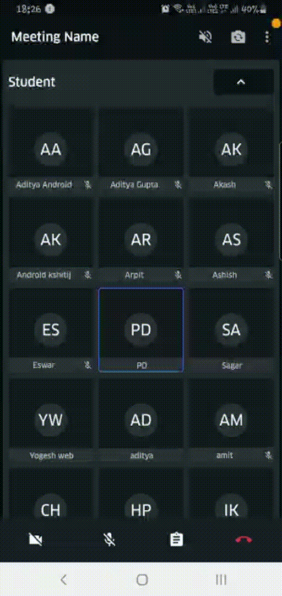
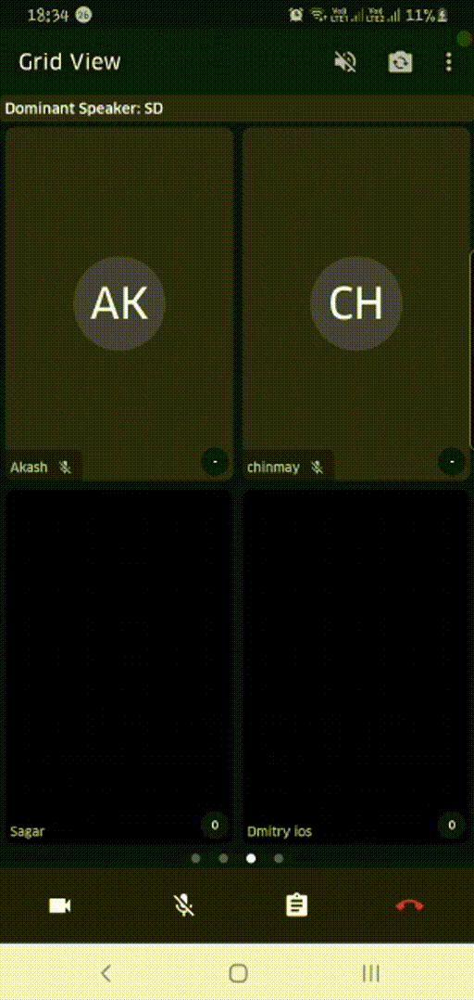
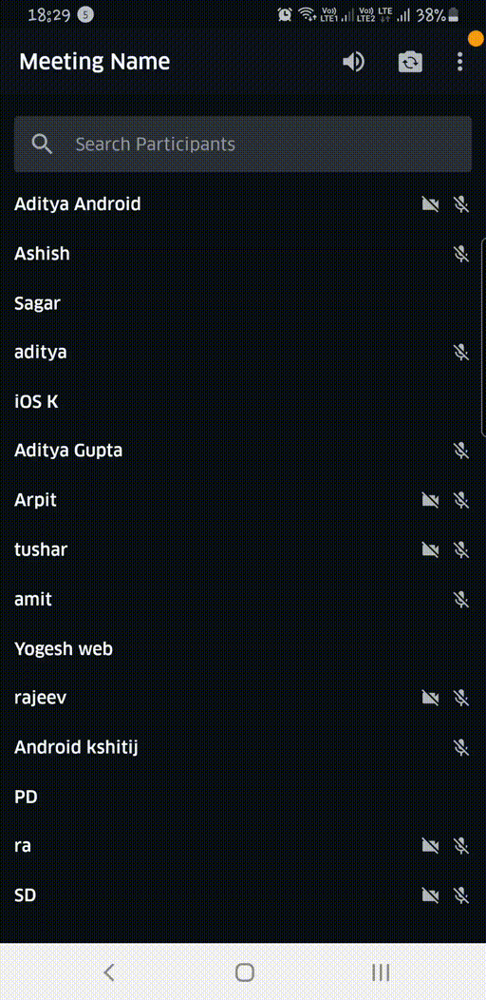

[](https://app.gitbook.com/@100ms/s/100ms-v2/release-notes)
[](https://docs.100ms.live/)
[](https://join.slack.com/t/100mslive/shared_invite/zt-llwdnz11-vkb2RzptwacwXHO7UeY0CQ)
[](mailto:founders@100ms.live)

<p align="center" >
  <a href="https://100ms.live/">
  
</p>

# 🎉 100ms SDK ＆ Sample App 🚀

Here you will find everything you need to build experiences with video using 100ms Android SDK. Dive into our SDKs, quick starts, add real-time video, voice, and screen sharing to your web and mobile applications.

## ☝️ Pre-requisites

- Android Studio 3.0 or higher
- Support for Android API level 24 or higher
- Support for Java 8
- This application uses build tool version `30.0.2`

## 📱 Supported Devices

The Android SDK supports Android API level 21 and higher. It is built for armeabi-v7a, arm64-v8a, x86, and x86_64 architectures.

## 🚂 Setup Guide

- Clone this repository

```bash
git clone --depth 1 https://github.com/100mslive/sample-app-android.git
```

- Host your token generation service [following this guide](https://app.gitbook.com/@100ms/s/100ms-v2/server-side/generate-client-side-token)

- Create `app/gradle.properties`

  ```bash
  cp app/example.gradle.properties app/gradle.properties
  ```

- Put your endpoint URL as `TOKEN_ENDPOINT` in `app/gradle.properties`. Make sure it ends with a backslash (`/`) For example:
  ```env
  TOKEN_ENDPOINT="https://prod-in.100ms.live/hmsapi/<your-subdomain>/" # Valid
  TOKEN_ENDPOINT="https://prod-in.100ms.live/hmsapi/<your-subdomain>" # Invalid
  ```
- Create [firebase project](https://firebase.google.com/docs/android/setup#console) and save the [`google-services.json`](https://support.google.com/firebase/answer/7015592?hl=en) in `app/google-services.json`

## 🏎 Run the application

### 🤖 Run using Emulator

Follow the official guide at [developers.android.com](https://developer.android.com/studio/run/emulator) to download and deploying app in a emulator.

### 📱 Run on Device (**recommended**)

Follow the official guide at [developers.android.com](https://developer.android.com/studio/run/device) to setup your mobile device for development.

On the first time of launch, user will be prompted with permissions. Then you are good to go to run the application.

## 🏞 Layout

In the launch screen, here we have `Enter Name` and `Join Room`:

We have many examples for each mode in the sample app using [`RecyclerView`](https://developer.android.com/reference/androidx/recyclerview/widget/RecyclerView), [`ViewPage2`](https://developer.android.com/jetpack/androidx/releases/viewpager2), [`LiveData](https://developer.android.com/topic/libraries/architecture/livedata) handling all data the right way with smooth updates.

### 📞 Join meeting

- Paste the exact Room ID as obtained from the [`create-room` API](https://app.gitbook.com/@100ms/s/100ms-v2/server-side/create-room)

- Click `Join Now`.
- Video Conversation will be started 🎉


### Active Speaker Mode

Shows the most actively speaking `Peer`'s in the room. Max number of peer's to be displayed can be configured be `Max Rows` and `Max Columns` setting in the Home Page.

Each `Peer`'s VideoTile shows following updates in real-time:

1. Blue border if speaking at that moment
2. Audio/Video track's mute/unmute status
3. Live Updates of `Peer`'s joining and leaving

Related classes/files in this app:
  1. [`ActiveSpeakerFragment`](app/src/main/java/live/hms/app2/ui/meeting/activespeaker/ActiveSpeakerFragment.kt)
  2. [`ActiveSpeakerLRU`](app/src/main/java/live/hms/app2/ui/meeting/activespeaker/ActiveSpeakerLRU.kt)
  3. [`fragment_active_speaker.xml`](app/src/main/res/layout/fragment_active_speaker.xml)
  4. [`video_card.xml`](app/src/main/res/layout/video_card.xml)

<p>
  
  
</p>

### 🎵 Audio Only Mode

Groups all `Peer`'s by their `Peer::role` and shows them using a nested `RecyclerView`:

Each `Peer`'s AudioTile shows following updates in real-time:

1. Blue border if speaking at that moment
2. Audio/Video track's mute/unmute status
3. Live Updates of `Peer`'s joining and leaving

Related classes/files in this app:
  1. [`AudioCollection`](app/src/main/java/live/hms/app2/ui/meeting/audiomode/AudioCollection.kt)
  2. [`AudioCollectionAdapter`](app/src/main/java/live/hms/app2/ui/meeting/audiomode/AudioCollectionAdapter.kt)
  3. [`AudioCollectionDiffUtil`](app/src/main/java/live/hms/app2/ui/meeting/audiomode/AudioCollectionDiffUtil.kt)
  4. [`AudioItem`](app/src/main/java/live/hms/app2/ui/meeting/audiomode/AudioItem.kt)
  5. [`AudioItemsAdapter`](app/src/main/java/live/hms/app2/ui/meeting/audiomode/AudioItemsAdapter.kt)
  6. [`AudioItemsDiffUtil`](app/src/main/java/live/hms/app2/ui/meeting/audiomode/AudioItemsDiffUtil.kt)
  7. [`AudioModeFragment`](app/src/main/java/live/hms/app2/ui/meeting/audiomode/AudioModeFragment.kt)
  8. [`fragment_audio.xml`](app/src/main/res/layout/fragment_audio.xml)
  9. [`list_item_audio.xml`](app/src/main/res/layout/list_item_audio.xml)
  10. [`list_item_chat.xml`](app/src/main/res/layout/list_item_chat.xml)

<p>
  
  
</p>

### 📚 Grid View

Show's all `Peer`'s in a 2x2 (default) Grid paginated using a `ViewPager`.

Each `Peer`'s VideoTile shows following updates in real-time:

1. Blue border if speaking at that moment
2. Audio/Video track's mute/unmute status
3. Live Updates of `Peer`'s joining and leaving
4. Subscribes/Unsubscribe videos which are not visible in the viewport
5. Handles updating the peer tracks status and peer-list smoothly without causing any re-renders

Related classes/files in this app:
  1. [`VideoGridBaseFragment`](app/src/main/java/live/hms/app2/ui/meeting/commons/VideoGridBaseFragment.kt)
  2. [`VideoGridAdapter`](app/src/main/java/live/hms/app2/ui/meeting/videogrid/VideoGridAdapter.kt)
  3. [`VideoGridFragment`](app/src/main/java/live/hms/app2/ui/meeting/videogrid/VideoGridFragment.kt)
  4. [`VideoGridPageFragment`](app/src/main/java/live/hms/app2/ui/meeting/videogrid/VideoGridPageFragment.kt)
  5. [`VideoGridPageItem`](app/src/main/java/live/hms/app2/ui/meeting/videogrid/VideoGridPageItem.kt)
  6. [`VideoGridPageDiffUtil`](app/src/main/java/live/hms/app2/ui/meeting/videogrid/VideoGridPagerDiffUtil.kt)
  7. [`VideoGridPageViewModel`](app/src/main/java/live/hms/app2/ui/meeting/videogrid/VideoGridPageViewModel.kt)
  8. [`fragment_video_grid_page.xml`](app/src/main/res/layout/fragment_video_grid_page.xml)
  9. [`fragment_grid_video.xml`](app/src/main/res/layout/fragment_grid_video.xml)
  10. [`grid_item_video.xml`](app/src/main/res/layout/grid_item_video.xml)



### 🙋🙋‍♀️ Hero View (experimental support 🧪)

Allows pinning any `Peer` video tile by clicking on respective `Peer`'s VideoTile from the 
bottom tray. The bottom tray is implemented using a `RecyclerView`

Related classes/files in this app:
  1. [`PinnedVideoFragment`](app/src/main/java/live/hms/app2/ui/meeting/pinnedvideo/PinnedVideoFragment.kt)
  2. [`VideoListAdapter`](app/src/main/java/live/hms/app2/ui/meeting/participants/VideoListAdapter.kt)
  3. [`VideoListItem`](app/src/main/java/live/hms/app2/ui/meeting/pinnedvideo/VideoListItem.kt)
  4. [`VideoListItemDiffUtil`](app/src/main/java/live/hms/app2/ui/meeting/pinnedvideo/VideoListItemDiffUtil.kt)
  5. [`fragment_pinned_video.xml`](app/src/main/res/layout/fragment_pinned_video.xml)
  6. [`fragment_pinned_video.xml`](app/src/main/res/layout-land/fragment_pinned_video.xml)
  7. [`list_item_video.xml`](app/src/main/res/layout/list_item_video.xml)


### ✋ Participant List View

Shows a list of all `Peer`'s in the room. 
  1. Entire list can be filter by `name` of the `Peer`
  2. Updates the list in real-time as `Peer`'s joins/leaves
  2. Show real-time status of `Peer` tracks and screen-share

Related classes/files in this app:
  1. [`ParticipantsAdapter`](app/src/main/java/live/hms/app2/ui/meeting/participants/ParticipantsAdapter.kt)
  2. [`ParticipantsFragment`](app/src/main/java/live/hms/app2/ui/meeting/participants/ParticipantsFragment.kt)
  3. [`fragment_participants.xml`](app/src/main/res/layout/fragment_participants.xml)
  4. [`list_item_peer_list.xml`](app/src/main/res/layout/list_item_peer_list.xml)



## 📑 100ms SDK Documentation

This guide provides an overview of the key objects you'll use with 100ms' android SDK to build a live audio/video application

### 🧐 Key Concepts

- `Room` - A room represents real-time audio, video session, the basic building block of the 100mslive Video SDK
- `Track` - A track represents either the audio or video that makes up a stream
- `Peer` - A peer represents all participants connected to a room. Peers can be "local" or "remote"
- `Broadcast` - A local peer can send any message/data to all remote peers in the room

### ⚙️ Pre-requisites

#### 1. Add dependency to 100ms lib

- Add the JitPack repository to your build file. Add it in your root `build.gradle` at the end of repositories of `allprojects`:

```gradle 
allprojects {
		repositories {
			...
			maven { url 'https://jitpack.io' }
		}
	}
```

- Add the dependency in your app-level `gradle`

```gradle 
dependencies {
		implementation 'com.github.100mslive:android-sdk:x.x.x'
	}
```

#### 2. Add other dependencies

Add all the following libraries in your app-level `gradle` file as dependencies.

- If you are using any of the following libraries already in your application, you can use the version you are already using.
- Make sure `okhttp` and `webrtc` use the same version as mentioned below

```implementation 'org.webrtc:google-webrtc:1.0.32006'
implementation 'com.squareup.okhttp3:okhttp:3.6.0'
implementation 'com.google.code.gson:gson:2.8.6'
implementation 'org.jetbrains:annotations:15.0'
```

#### 3. Get Access Keys

Sign up on https://dashboard.100ms.live/register & visit Developer tab to get your access credentials

#### 4. Generate a server-side token

To generate a server-side token, follow the steps described here - https://app.gitbook.com/@100ms/s/100ms-v2/server-side/generate-server-side-token

#### 5. Create a room

To create a room, follow the steps described here - https://app.gitbook.com/@100ms/s/100ms-v2/server-side/create-room

#### 6. Generate a client-side token

To generate a client-side token, follow the steps described here - https://app.gitbook.com/@100ms/s/100ms-v2/server-side/generate-client-side-token

### 💪🏻 Create and instantiate 100ms Client (`HMSSDK`)

This will instantiate an `HMSClient` object

```kotlin
val hmsSDK = HMSSDK
  .Builder(application) // pass the application context
  .setTrackSettings(hmsTrackSettings) // optional -- to set a track settings different from default
  .setAnalyticEventLevel(HMSAnalyticsEventLevel.ERROR) // optional -- set the analytical level
  .setLogLevel(HMSLogger.LogLevel.VERBOSE) // optional -- set the logging level
  .build()

```

> `authTokenis` the client-side token generated by your token generation service.

> This `roomId` should be generated using createRoom API

### ⚙ Provide joining configuration

To join a room created by following the steps described in the above section, clients need to create a `HMSConfig` instance and use that instance to call `join` method of `HMSSDK`

```kotlin
// Create a new HMSConfig
val config = HMSConfig(
  // The name that the user wants to be displayed while in the room
  username = "100ms User",

  // The auth token to be used
  authToken = "<auth-token>",

  // optional -- any  json string or metadata that user need to pass while joining
  metadata = "Anything extra/app-specific info about the peer available as peer description"
)

```

### ♻️ Setup event listeners

100ms SDK provides callbacks to the client app about any change or update happening in the room after a user has joined by implementing `HMSUpdateListener` . These updates can be used to render the video on screen or to display other info regarding the room.

```kotlin
val hmsUpdateListener = object : HMSUpdateListener {

  override fun onJoin(room: HMSRoom) {
    // This will be called on a successful JOIN of the room by the user
    // This is the point where applications can stop showing its loading state
  }

  override fun onPeerUpdate(type: HMSPeerUpdate, peer: HMSPeer) {
    // This will be called whenever there is an update on an existing peer
    // or a new peer got added/existing peer is removed.
    // This callback can be used to keep a track of all the peers in the room
  }

  override fun onRoomUpdate(type: HMSRoomUpdate, hmsRoom: HMSRoom) {
    // This is called when there is a change in any property of the Room
  }

  override fun onTrackUpdate(type: HMSTrackUpdate, track: HMSTrack, peer: HMSPeer) {
    // This is called when there are updates on an existing track
    // or a new track got added/existing track is removed
    // This callback can be used to render the video on screen whenever a track gets added
  }

  override fun onMessageReceived(message: HMSMessage) {
    // This is called when there is a new broadcast message from any other peer in the room
    // This can be used to implement chat is the room
  }

  override fun onError(error: HMSException) {
    // This will be called when there is an error in the system
    // and SDK has already retried to fix the error
  }
}
```

### 🙏 Join a room

Use the HMSConfig and HMSUpdateListener instances to call join method on the instance of HMSSDK created above.
Once Join succeeds, all the callbacks keep coming on every change in the room and the app can react accordingly

```kotlin
hmsSdk.join(config, hmsUpdateListener)

// You've successfully joined the meeting, enjoy! 🚀
```

### 👋 Leave Room

Call the leave method on the HMSSDK instance

```kotlin
hmsSdk.leave()
```

### 👌 Get Peers/tracks data

`HMSSDK` has other methods which the client app can use to get more info about the `Room` , `Peer` and `Tracks`

```kotlin
// to join a Room
HMSSDK::join(config: HMSConfig, hmsUpdateListener: HMSUpdateListener)

// to leave a Room
HMSSDK::leave()

// Returns the local peer, which contains the local tracks
HMSSDK::getLocalPeer(): HMSPeer

// Returns a list of all the remote peers present in the room currently
HMSSDK::getRemotePeers(): List<HMSPeer>

// Returns a list of all the peers present in the room currently
HMSSDK::getPeers(): List<HMSPeer>

// used to send message to all other peers via broadcast
HMSSDK::sendMessage(type: String, message: String)

// add a observer to listen to Audio Level Info of all peers. This will be
// called every second if set
HMSSDK::addAudioObserver(observer: HMSAudioListener)


// remove the audio level info observer
HMSSDK::removeAudioObserver()
```

### 🙊 Local & Remote Audio & Video

- Use the `HMSLocalAudioTrack` and `HMSLocalVideoTrack` to mute/unmute local audio/video tracks
- You can also set the volume for each `HMSRemoteAudioTrack` and `HMSRemoteVideoTrack` using the `setVolume(value)` method (value ranges in scale [0.0, 1.0] inclusive)

```kotlin
class HMSTrack {
    // This is a unique id of a given track
    val trackId: String

    // One of HMSTrackType.AUDIO or HMSTrackType.VIDEO
    val type: HMSTrackType

    // This denotes whether the given track is a `regular`, `screen` or `plugin` type
    val source: String

    // This can be set by client app while creating a HMSTrack. Default value is empty
    val description: String

    // This denotes where the current track is mute or not
    val isMute: Boolean
}

class HMSLocalAudioTrack {
    // Volume of the current Track
    var volume: Double

    // Settings of the given Audio Track
    val settings: HMSAudioTrackSettings

    // To mute or unmute the local audio track
    fun setMute(isMute: Boolean)

    // Application can use this to change settings of the audio track.
    fun setSettings(newSettings: HMSAudioTrackSettings)
}

class HMSRemoteAudioTrack {
    // Is local playback allowed of this track or not
    var isPlaybackAllowed: Boolean

    // Method to set the playback volume of remote audio track
    // value range is [0.0, 1.0] inclusive
    fun setVolume(value: Double)
}

class HMSVideoTrack {
    // Call this when app needs to render a track on screen
    // Internally it will automatically subscribe the video
    fun addSink(sink: VideoSink)

    // Call this when app no longer needs to rebder
    // Internally it will automatically unsubscribe the video, saving network bandwidth
    fun removeSink(sink: VideoSink)
}

class HMSLocalVideoTrack {
    // Settings of the given Video Track
    val settings: HMSVideoTrackSettings

    // To mute or unmute the local video track
    fun setMute(isMute: Boolean)

    // To set new settings
    fun setSettings(newSettings: HMSVideoTrackSettings)

    // To switch camera
    fun switchCamera()

    // To change to a particular camera
    fun switchCamera(deviceId: String)

    // Flips camera (front -> back, back -> front)
    fun switchCamera()
}

class HMSRemoteVideoTrack {
    var isPlaybackAllowed: Boolean // to set or get if local playback is allowed for the remote video track
}
```

### 🛤 HMSTracks Explained

`HMSTrack` is the super-class of all the tracks that are used inside `HMSSDK`. Its hierarchy looks like this -

```text
HMSTrack
    - HMSAudioTrack
        - HMSLocalAudioTrack
        - HMSRemoteAudioTrack
    - HMSVideoTrack
        - HMSLocalVideoTrack
        - HMSRemoteVideoTrack
```

### 📖 Details Docs

Refer the [Getting Started - Android](https://app.gitbook.com/@100ms/s/100ms-v2/android/getting-started-v2-android/@comments/b0013555092c48558d59c8e70e6474ca) guide in 100ms Gitbook.
